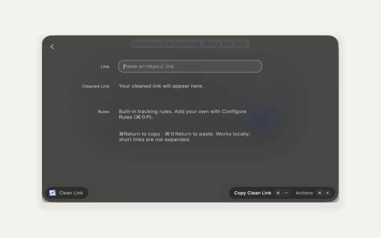

<p align="center">
  
</p>
<h1 align="center">Clean Link</h1>
<p align="center">Cleaner links, ready to share.</p>
<p align="center">A free, open-source Raycast extension that removes common tracking parameters on your Mac.<br>Preview what changes, then copy or paste.</p>
<p align="center">
  <a href="#install">Install on Mac</a> ·
  <a href="README.zh-TW.md">繁體中文</a> ·
  <a href="#privacy-and-limits">Privacy</a> ·
  <a href="CONTRIBUTING.md">Contribute</a>
</p>
<p align="center">
  <a href="LICENSE"></a>
  <a href="https://github.com/bblurock/clean-link/actions/workflows/ci.yml"></a>
</p>

<p align="center"></p>

<p align="center">A 15-second walkthrough of the actual Raycast form: enter a link, review the result, choose an action. <a href="docs/images/preview.jpg">Static screenshot</a>.</p>

```text
Before   https://example.com/?id=42&fbclid=demo
After    https://example.com/?id=42
```

## A small tool for everyday sharing

- **See what changes.** The cleaned link and removed parameter names appear together before you copy.
- **Keep the useful parts.** Built-in rules preserve timestamps, playlists, unknown parameters, and fragments. Common signed links are left unchanged.
- **Make it yours.** Add parameter names or prefix rules, and set exceptions for parameters you always want to keep.

No link fetching, analytics, or URL history of its own. Cleaning runs locally.

## Install

**Source installation for macOS.** This release is not in the Raycast Store. You need [Raycast](https://www.raycast.com/), [Node.js](https://nodejs.org/en/download) 22.22.2+ with npm, and Git. Node 24 also works.

1. Download the project and install its dependencies:

   ```sh
   git clone https://github.com/bblurock/clean-link.git
   cd clean-link
   npm ci
   ```

2. Register it with Raycast:

   ```sh
   npm run dev
   ```

3. Open Raycast, search **Clean Link**, and try `https://example.com/?id=42&fbclid=demo`.

Once the command is available, stop the development process with **Ctrl+C**. The installed command stays in Raycast, including after restarting your Mac. This follows [Raycast's local extension workflow](https://developers.raycast.com/basics/create-your-first-extension). If Raycast asks you to sign in for developer setup, follow its prompt; Clean Link has no separate account.

Prefer downloading a ZIP? Use **Code → Download ZIP** on GitHub, extract it, open a terminal in that folder, and start at `npm ci`.

### Use it

Opening Clean Link previews a complete HTTP/HTTPS URL from your clipboard when that preference is enabled. You can also paste a link into the **Link** field. Review the result, then choose an action:

| Action | Shortcut |
| --- | --- |
| Copy and close Raycast | ⌘Return |
| Paste into the previously active app | ⌘⇧Return |
| Load a link from the clipboard | ⌘⇧V |
| Configure rules | ⌘⇧P |
| Show all actions | ⌘K |

Clipboard preview never automatically copies or pastes.

### Update or uninstall

To update a Git checkout, run `git pull --ff-only`, `npm ci`, and `npm run dev` from its folder, then stop with Ctrl+C once registered. Keep any local changes safe before updating. ZIP installations can download and extract the new version, then repeat installation. There is no automatic update checker.

To remove the extension, open **Raycast Settings → Extensions**, select **Clean Link**, and use its removal action. Deleting the source folder alone does not remove the registered command.

## Customize your rules

Open **Configure Rules** with **⌘⇧P**, or find Clean Link in Raycast Settings → Extensions. Reopen the command after changing preferences.

| Setting | Example | Behavior |
| --- | --- | --- |
| Additional Parameters to Remove | `campaign_id, track_*` | Adds removal rules on every website |
| Parameters to Always Keep | `ref, campaign_id` | Overrides built-in and additional removal rules |
| Start with Clipboard | Enabled by default | Previews the current clipboard URL on launch |

Names are case-insensitive and can be separated by commas or whitespace. A final `*` matches a prefix: `track_*` matches `track_source`, but not `track`. Letters, digits, `_`, `-`, `.`, and `~` are supported. Enter names only, without `?`, `&`, or `=value`.

A bare `*`, regular expressions, and wildcards in the middle are rejected. Invalid settings show an explanation and prevent copying until corrected. Leave the rule fields empty to use the built-in defaults. Common signed-link protection takes priority over all custom rules.

## What gets cleaned?

| Link | Built-in behavior |
| --- | --- |
| Any website | Removes `utm_*` and common identifiers including `fbclid`, `gclid`, and `msclkid` |
| YouTube | Removes `si`; keeps video IDs, `t`, playlists, and playback position parameters |
| Instagram | Removes `igsh` and the general `igshid` rule |
| Facebook | Removes `mibextid` and general tracking parameters |
| Spotify track links | Removes `si` on `open.spotify.com` |
| X / Twitter post links | Removes `s` and `t` on numeric status paths |
| Common signed/access-token links | Leaves the whole URL unchanged and explains why |

[Read the full rule set](src/clean-url.ts). Retained query values keep their original encoding, order, and duplicates. Unknown parameters, paths, and fragments remain intact. Removal is conservative; it does not guarantee every tracker is removed or every website remains compatible.

## Privacy and limits

The extension does not open the pasted URL, make network requests to resolve it, execute page scripts, send analytics, or save its own URL history. It reads the clipboard on launch only when enabled, or when you choose **Use Link from Clipboard**. Copy/paste actions write the result; Raycast's own clipboard-history settings still apply.

Installing and updating dependencies contacts npm and GitHub. Raycast's own services are separate from this extension's local cleaning behavior.

**Short links stay short.** Opaque links such as `threads.com/share/...`, `bit.ly/...`, and `t.co/...` are not expanded. The destination may exist only on the provider's server. Looking it up can itself be logged, even without browser cookies. A clean-looking URL is not proof that it contains no tracking.

There is no redirect unwrapping in this release, including wrappers that embed a destination. Tracking inside paths or fragments is also left intact. Signed-link detection is a heuristic, not a guarantee of compatibility. Review unusual links before sharing.

## Help shape it

Found a parameter we missed? [Suggest a rule](https://github.com/bblurock/clean-link/issues/new?template=tracking_rule.yml) with a safe example and evidence that it can be removed. [Report a bug](https://github.com/bblurock/clean-link/issues/new?template=bug_report.yml), improve a translation, or share the project with someone who would use it.

Made by [Benson Lu](https://github.com/bblurock). Follow along there for more small tools.

## Development

```sh
npm ci
npm test
npm run typecheck
npm run build
```

The URL logic is in [`src/clean-url.ts`](src/clean-url.ts); the native Raycast form is in [`src/clean-link.tsx`](src/clean-link.tsx). Tests and type checks run without Raycast. Building/registering the extension uses the Raycast CLI and writes to its local configuration directory on macOS.

Run `npm run icons` to export the included artwork and editable utility SVGs. See the [contribution guide](CONTRIBUTING.md), [icon design notes](design/ICONS.md), and [changelog](CHANGELOG.md).

## License and credits

[MIT](LICENSE). Free to use, modify, and share.

Built with the [Raycast API](https://developers.raycast.com/). Dependencies retain their own licenses. The app artwork was created with AI image generation and refined through visual review; the selected source and utility SVGs are included. Its warm paper, ink, and blue direction follows Benson's Open Studio design principles.
