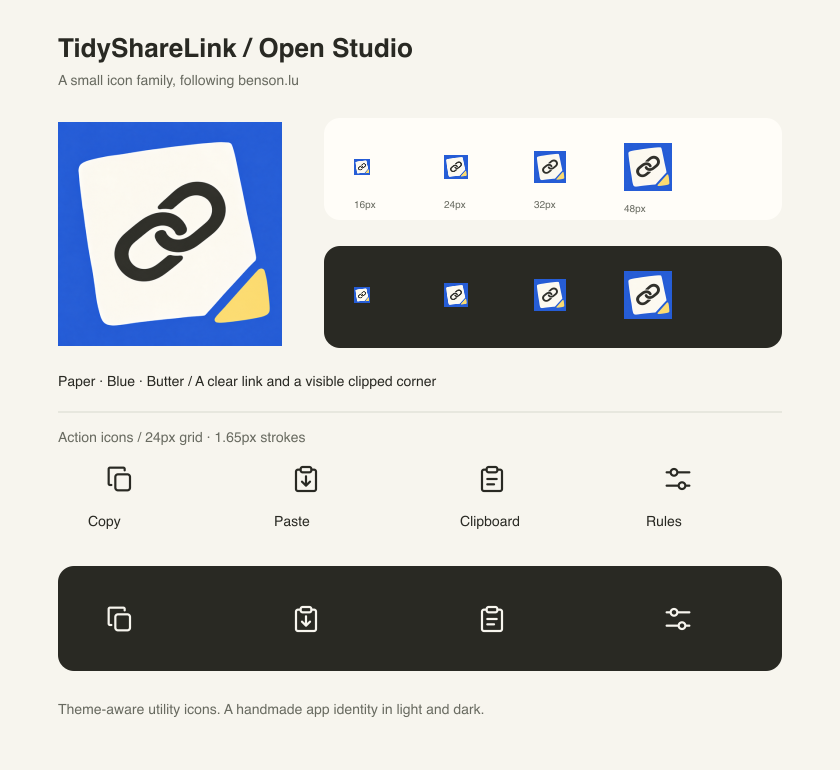

# TidyShareLink icons

TidyShareLink follows Benson's Open Studio direction: warm paper, confident ink, a clear blue field, and a slightly irregular silhouette. It should feel human and remain legible in a small Raycast row.

## App icon

The approved mark is a cream clipped-paper shape on blue, with a bold dark link and a detached butter-yellow corner. The link gives it meaning; the paper gives it character. The corner was enlarged and brightened after testing at small sizes.

Palette direction:

- Paper `#F7F5EE`
- Blue `#355FC0`
- Ink `#292923`
- Bright Butter `#F4DC83`

The source is AI-generated artwork refined through visual review, so individual pixels have slight tonal variation. Avoid adding shadows, folds, sparkle symbols, or simulated volume.

The selected source is [`icons/clean-link-final-source.png`](icons/clean-link-final-source.png). Raycast uses its 512 × 512 export at [`../assets/clean-link-final.png`](../assets/clean-link-final.png).

## Action icons

Copy, paste, clipboard, and rules share a 24px grid, 1.65px strokes, rounded caps and joins, and aligned geometry. Keep these precise enough to read at utility sizes. Editable SVGs are in `icons/`; light and dark PNG exports are in `../assets/actions/`.

Light-mode strokes use Ink, dark-mode strokes use Paper. The app mark retains its blue field in either theme. Icons are static; Raycast supplies action feedback.



## Export

From the repository root:

```sh
npm ci
npm run icons
npm run build
```

Sharp is included as a development dependency. The renderer exports the app icon, eight utility assets, and this preview board. The extension runtime does not import Sharp.
